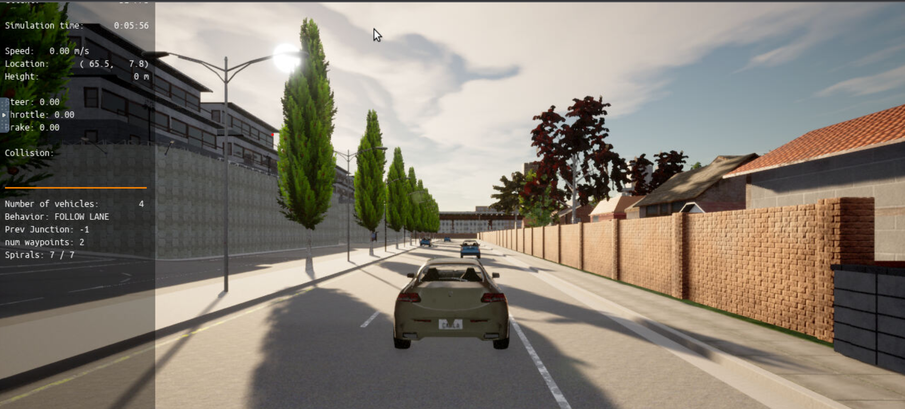
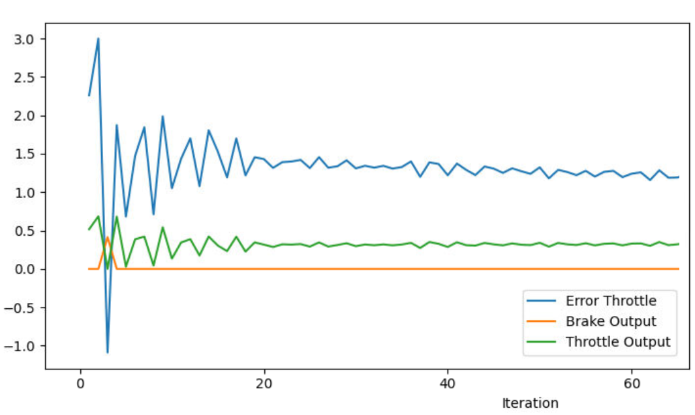
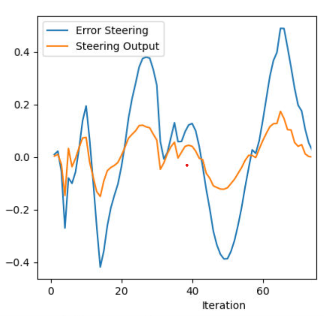

# Control and Trajectory Tracking for Autonomous Vehicle

This project is done in case of Self-Driving Car Engineer Nanodegree<br/>
https://www.udacity.com/course/self-driving-car-engineer-nanodegree--nd013
# Proportional-Integral-Derivative (PID)

In this project, we will perform vehicle trajectory tracking. Given a trajectory as an array of locations and a simulation environment, we will design and code a PID controller and test its efficiency on the CARLA simulator used in the industry.

### Installation

Run the following commands to install the starter code in the Udacity Workspace:

Clone the <a href="https://github.com/pArtheum/Control-Trajectory.git" target="_blank">repository</a>:

`git clone https://github.com/pArtheum/Control-Trajectory.git`


## Usage 
### Run Carla Simulator

Open new window

* `su - student`
// Will say permission denied, ignore and continue
* `cd /opt/carla-simulator/`
* `SDL_VIDEODRIVER=offscreen ./CarlaUE4.sh -opengl`

### Compile and Run the Controller

Open new window

* `cd Control-Trajectory/project`
* `./install-ubuntu.sh`
* `cd pid_controller/`
* `rm -rf rpclib`
* `git clone https://github.com/rpclib/rpclib.git`
* `cmake .`
* `make` (This last command compiles your c++ code, run it after every change in your code)

### Testing

To test your installation run the following commands.

* `cd Control-Trajectory/project`
* `./run_main_pid.sh`
This may silently fail `ctrl + C` to stop
* `./run_main_pid.sh` (again)
Go to desktop mode to see CARLA

If error bind is already in use, or address already being used

* `ps -aux | grep carla`
* `kill id`


## Project Instructions

In the previous project we built a path planner for the autonomous vehicle. Now we will build the steer and throttle controller so that the car follows the trajectory. To do so, we will will design and run a PID controller as described in the previous course.

### Step 1: Build the PID controller object

For the step1 of the project, we design the PID class. If we succeed, the vehicle must stay in place as seen on below screenshot.



### Step 2: PID controller for throttle:

### Step 3: PID controller for steer:


### Step 4: Evaluate the PID efficiency
The values of the error and the pid command are saved in thottle_data.txt and steer_data.txt.
Plot the saved values using the command (in Control-Trajectory/project):

```
python3 plot_pid.py
```

You might need to install a few additional python modules: 

```
pip3 install pandas
pip3 install matplotlib
```


<br>
We observe, that at the beginning, the error is quite high, probably due to initialisation/synchronization step when the car starts to drive. But, after few iterations, the error becomes quite stable.
<br>


<br>
We observe that, for steering, each time we have to steer, the error increase. Probably, our PID needs to be tuned better, because it means that either we steer to much or the opposite, not enough.
<br>

Answer the following questions:
- Add the plots to your report and explain them (describe what you see)
- What is the effect of the PID according to the plots, how each part of the PID affects the control command?

>- P(Proportional) affect how powerfull will be the correction regarding the error.
>- I(Integral) allow to reach faster the convergence.
>- D(Derivative) allow to smooth the oscillation and make the system more stable

- How would you design a way to automatically tune the PID parameters?
As seen during classes, we can use Twiddle algorithm to tune PID parameters. But we can also use some rules to apply based on curves as it's done in electronics to tune PID's. 

- PID controller is a model free controller, i.e. it does not use a model of the car. Could you explain the pros and cons of this type of controller?

    <ul>
        <li>Pros<ul>
            <li>Generic model: can be deployed on any vehicle.</li>
            <li>Easy to develop.</li>
            <li>Simple Maintenance and Tuning.</li>
        </ul>
        </li>
        <li>Cons<ul>
            <li>Generic Model: may not be suited for all vehicle and the error may drastically increase.</li>
        </ul>
        </li>
    </ul>
    <br>
- (Optional) What would you do to improve the PID controller?

>- Maybe based on generic PID, add some vehicle specific parameters, like maximum steering speed, etc.

### Tips:

- When you wil be testing your c++ code, restart the Carla simulator to remove the former car from the simulation.
- If the simulation freezes on the desktop mode but is still running on the terminal, close the desktop and restart it.
- When you will be tuning the PID parameters, try between those values:

# Acknowledgement

Thanks to Udacity Mentors Help section and all students that faced the same issues as me to help me to find the best parameters for different algorithms.